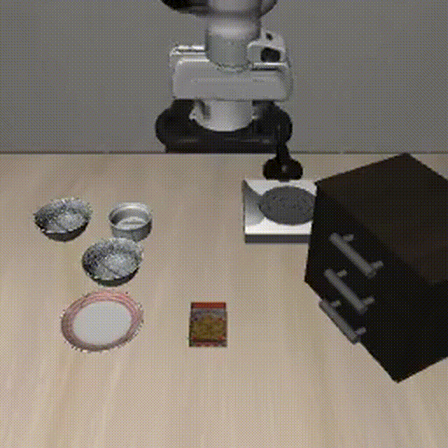
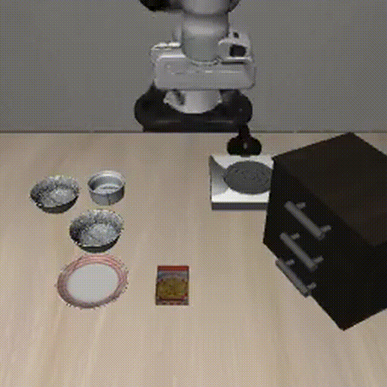
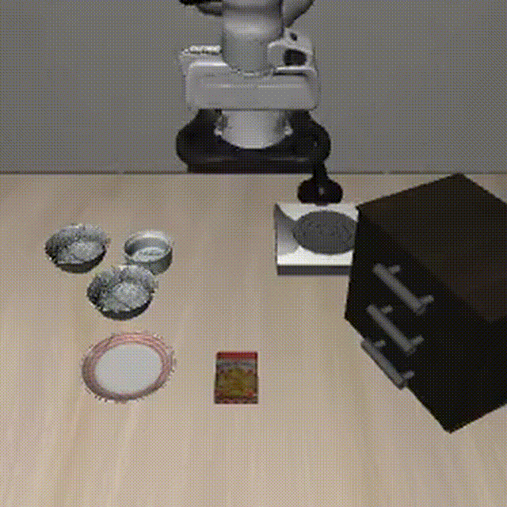
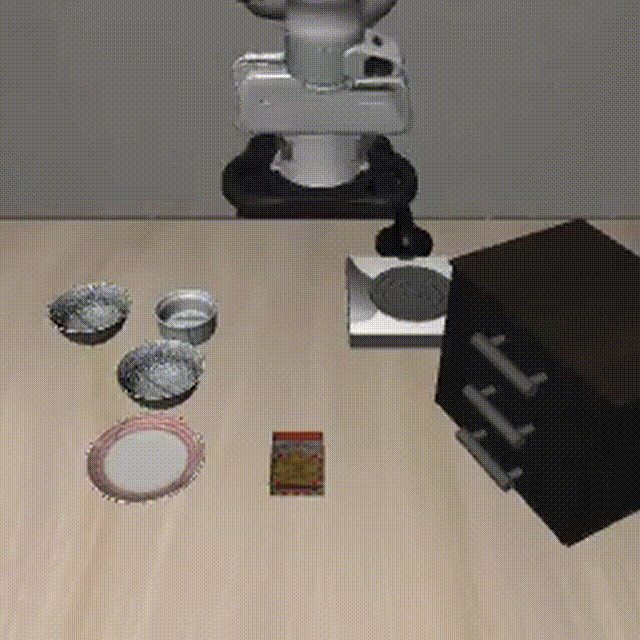
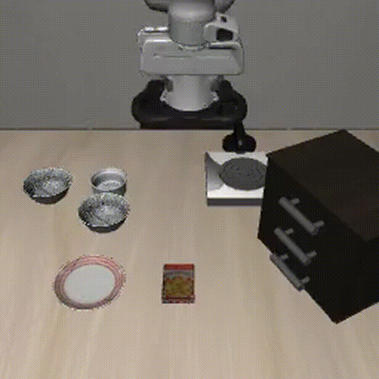

# SmolVLA Fine-Tuning on LIBERO

Fine-tuning [SmolVLA](https://huggingface.co/lerobot/smolvla_base) (450M param Vision-Language-Action model) on the [LIBERO](https://huggingface.co/datasets/HuggingFaceVLA/libero) robot manipulation benchmark using LoRA, with evaluation in simulation.

Built for the **SmolVLA training on LIBERO**.

## Results Summary

| Condition | Task Suite | Success Rate |
|-----------|-----------|-------------|
| In-distribution (task 0, 5 episodes) | libero_spatial | **100%** *(Run 3: `smolvla_libero` base)* |
| OOD — Objects | libero_object | **N/A** *(not completed; compute constraints)* |
| OOD — Goals | libero_goal | **N/A** *(not completed; compute constraints)* |

| Ablation | LoRA Rank | Final Loss | Success Rate |
|----------|-----------|------------|-------------|
| Run 1 (primary, `smolvla_base`) | r=32 | **0.143** | **0%** |
| Run 2 (ablation, `smolvla_base`) | r=8 | **0.155** | **0%** |

**Key takeaway:** base checkpoint choice dominated performance: switching from `smolvla_base` → `smolvla_libero` improved ID success from **0% → 100%** (see `report.pdf`).

## Evaluation Videos (GIF previews)

GitHub may not render `.mp4` inline, so we include GIF previews below (download the `.mp4` for full quality).

### LoRA (rank 32) — `smolvla_base` (fails, jittery behavior)

| 2.5k steps | 5k steps |
|---|---|
|  |  |

### LoRA (rank 32) — `smolvla_libero` (succeeds)

| 5k steps (early) | 10k steps | 15k steps |
|---|---|---|
|  |  |  |

## Model Checkpoints

- **Primary (LoRA r=32):** [goelshivam1210/smolvla-libero-lora-r32](https://huggingface.co/goelshivam1210/smolvla-libero-lora-r32)
- **Ablation (LoRA r=8):** [goelshivam1210/smolvla-libero-lora-r8](https://huggingface.co/goelshivam1210/smolvla-libero-lora-r8)

## Setup

```bash
# Clone the repo
git clone https://github.com/goelshivam1210/smolvla-libero.git
cd smolvla-libero

# Create environment (Python 3.10+ required)
python -m venv venv
source venv/bin/activate

# Install dependencies
pip install -r requirements.txt

# Set rendering backend (for headless servers)
export MUJOCO_GL=egl
```

### Environment Notes

- **GPU + Linux/Colab recommended** for training and full simulation-based evaluation (requires several GB of disk for the LIBERO dataset and MuJoCo rendering).
- On macOS, we recommend using only the dataset analysis/visualization scripts; training and eval may fail due to missing GPU and limited disk.

## Reproducing Results

### 1. Dataset Analysis

```bash
python scripts/analyze_dataset.py
```

Outputs analysis plots to `results/plots/dataset_analysis.png` and train/val split to `data/episode_split.json`.

### 2. Training

**Run 1 — Primary (LoRA r=32):**
```bash
python scripts/train.py \
    --run_name smolvla-libero-lora-r32 \
    --lora_rank 32 \
    --lr 2e-4 \
    --steps 5000 \
    --batch_size 32
```

**Run 2 — Ablation (LoRA r=8):**
```bash
python scripts/train.py \
    --run_name smolvla-libero-lora-r8 \
    --lora_rank 8 \
    --lr 2e-4 \
    --steps 5000 \
    --batch_size 32
```

Training can also be reproduced via the Colab notebook: [`notebooks/smolvla_train.ipynb`](notebooks/smolvla_train.ipynb)

### 3. Evaluation

**In-distribution (libero_spatial, local checkpoint path):**
```bash
python scripts/evaluate.py \
    --checkpoint ./outputs/smolvla-libero-lora-r32/checkpoints/last/pretrained_model \
    --task_suite libero_spatial
```

**In-distribution using published Hugging Face model:**
```bash
python scripts/evaluate.py \
    --checkpoint goelshivam1210/smolvla-libero-lora-r32 \
    --task_suite libero_spatial \
    --task_ids "[0]" \
    --n_episodes 5 \
    --output_dir ./outputs/eval-r32
```

**Out-of-distribution (using local checkpoint or HF model):**
```bash
# OOD — Different objects
python scripts/evaluate.py \
    --checkpoint goelshivam1210/smolvla-libero-lora-r32 \
    --task_suite libero_object

# OOD — Different goals
python scripts/evaluate.py \
    --checkpoint goelshivam1210/smolvla-libero-lora-r32 \
    --task_suite libero_goal
```

## Project Structure

```
├── scripts/
│   ├── analyze_dataset.py    # Part 1: Dataset analysis
│   ├── train.py              # Part 2: Training wrapper
│   └── evaluate.py           # Part 4: Evaluation wrapper
├── configs/
│   └── train_config.yaml     # All hyperparameters documented
├── notebooks/
│   └── smolvla_train.ipynb   # Colab notebook (actual training)
├── results/
│   ├── plots/                # Training curves, dataset analysis
│   └── videos/               # Eval recordings (success + failure)
├── writeup.md                # 1-page writeup
├── requirements.txt
└── README.md
```

## Dataset

**HuggingFaceVLA/libero** — preprocessed LIBERO benchmark in LeRobot format.

| Property | Value |
|----------|-------|
| Robot | Panda arm |
| Episodes | 1,693 |
| Frames | 273,465 |
| FPS | 10 |
| Tasks | 40 (10 per suite) |
| Cameras | 2× RGB 256×256 (front + wrist) |
| State | 8-dim (7 joints + gripper) |
| Actions | 7-dim (6 DOF EE delta + gripper) |

**Note:** LIBERO uses different image keys than SmolVLA expects. The `--rename_map` flag handles this automatically.

## Training Details

- **Base model:** `lerobot/smolvla_base` (450M params, pretrained on LeRobot community data)
- **Fine-tuning method:** LoRA (Low-Rank Adaptation) via HuggingFace PEFT
- **Compute:** NVIDIA A100-SXM4-80GB (Google Colab Pro)
- **Training time:** ~60 min per run (5000 steps)
- **Key hyperparameters:** See [`configs/train_config.yaml`](configs/train_config.yaml)

## Ablation Study

We compare LoRA rank 32 vs rank 8, keeping all other hyperparameters identical. This tests whether a lower-rank adaptation (fewer trainable parameters) is sufficient for the LIBERO benchmark.

See [`writeup.md`](writeup.md) for full analysis.

## References

- [SmolVLA Paper](https://arxiv.org/abs/2506.01844)
- [SmolVLA Documentation](https://huggingface.co/docs/lerobot/smolvla)
- [LeRobot GitHub](https://github.com/huggingface/lerobot)
- [LIBERO in LeRobot](https://huggingface.co/docs/lerobot/libero)
- [PEFT Training Docs](https://huggingface.co/docs/lerobot/peft_training)
